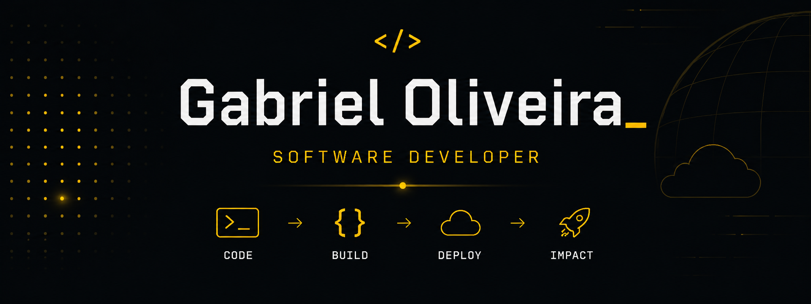

# HTTP/1.1 200 OK 👋

### Hey, I'm Gabriel — Software Developer

I enjoy turning ideas into real products and building practical, well-structured software.

I'm especially interested in **backend development, full-stack applications, APIs, databases, and cloud technologies**, always looking to understand not just how things work, but how to build them better.

## Currently

- Building real-world software projects.
- Deepening my backend and full-stack knowledge.
- Learning cloud computing and improving my software engineering practices.

## 🚀 Featured Projects

### 🍀 Trevo

A full-stack platform for organizing amateur football games, from public registration and waitlists to recurring schedules, balanced team draws, and payments.

**Highlights:** Transactional workflows · Recurring games · Rating-based team draw · Pix payments

**Tech:** React · TypeScript · PostgreSQL · Supabase · Tailwind CSS

🔒 Private Repository

### 🎯 Valorant Rank Overlay

A real-time rank and RR overlay for VALORANT streams, featuring a control dashboard and an OBS-ready transparent view.

**Highlights:** Real-time WebSockets · Transactional rank updates · Animated rank transitions

**Tech:** React · TypeScript · FastAPI · PostgreSQL · SQLAlchemy · WebSockets

🔒 Private Repository

## 🛠️ Technical Stack

### Languages and Technologies

  

### Frameworks and Libraries

  

### Tools & Platforms

  

## 🔗 Connect With Me

 &nbsp; 